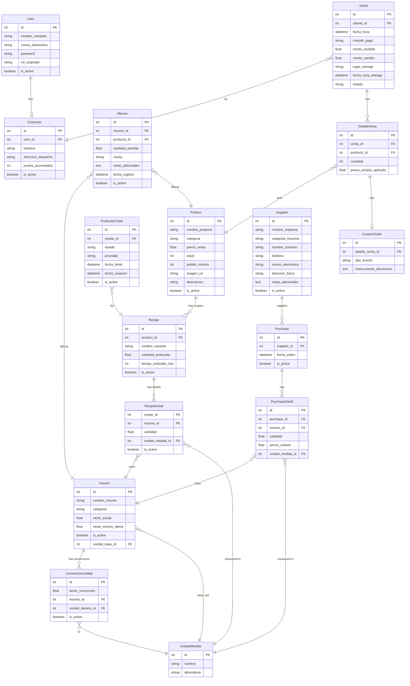

# Maison Code

## 📋 Descripción

**Maison Code** es una aplicación web desarrollada en **Flask** diseñada para la empresa Maison Glace, dedicada a la producción y distribución de postres. La aplicación proporciona un sistema integral de gestión que cubre desde la administración de insumos hasta la venta final de productos.

### Características Principales

La aplicación incluye los siguientes módulos:

- **👥 Usuarios** - Gestión de permisos y acceso de usuarios
- **📦 Insumos** - Control de materias primas e ingredientes
- **🍰 Productos** - Catálogo de productos terminados
- **🛒 Punto de Venta** - Sistema de ventas en mostrador
- **📲 Pedidos Online** - Gestión de pedidos a través de plataforma web
- **👨‍💼 Clientes** - Base de datos de clientes
- **🏭 Producción** - Planificación y control de procesos de fabricación
- **🚚 Proveedores** - Gestión de relaciones con proveedores
- **📊 Reportes** - Generación de reportes y análisis
- **🗑️ Mermas** - Control de pérdidas y desperdicio
- **💳 Compras** - Gestión de órdenes de compra
- **⚙️ Configuración del Sistema** - Parámetros generales de la aplicación

---

## �️ Modelo de Base de Datos

A continuación se presenta el diagrama entidad-relación de la base de datos utilizada por la aplicación:



---

## �🚀 Instalación y Ejecución

### Requisitos Previos

- Python 3.10 o superior
- Git
- pip (gestor de paquetes de Python)
- Node.js y npm

### Pasos de Instalación

1. **Clonar el repositorio desde GitHub:**
   ```bash
   git clone https://github.com/IDGS-803-22001418/glace-code
   ```

2. **Acceder a la carpeta del proyecto:**
   ```bash
   cd glace-code
   ```

3. **Crear un entorno virtual:**
   ```bash
   python -m venv .venv
   ```

4. **Activar el entorno virtual:**
   - En Linux/macOS:
     ```bash
     source .venv/bin/activate
     ```
   - En Windows:
     ```bash
     .venv\Scripts\activate
     ```

5. **Instalar las dependencias:**
   ```bash
   pip install -r requirements.txt
   ```

6. **Instalar dependencias de frontend:**
   ```bash
   npm install
   ```

7. **Compilar estilos con Tailwind CSS:**
   ```bash
   npx @tailwindcss/cli -i ./app/static/src/input.css -o ./app/static/dist/output.css
   ```

8. **Ejecutar migraciones de base de datos:**
   ```bash
   flask db upgrade
   ```

9. **Ejecutar la aplicación:**
   ```bash
   python run.py
   ```

   La aplicación estará disponible en `http://localhost:5000`

---

## 👨‍💻 Para Desarrolladores

### Estructura del Proyecto

```
maison-code/
├── app/                               # Código principal de la aplicación
│   ├── __init__.py                    # Inicialización de Flask
│   ├── decorators.py                  # Decoradores personalizados
│   ├── models.py                      # Modelos de base de datos
│   ├── routes/                        # Rutas
│   ├── static/                        # Archivos estáticos
│   └── templates/                     # Plantillas HTML
├── migrations/                        # Migraciones de Flask-Migrate/Alembic
├── tests/                             # Pruebas
├── config.py                          # Configuración de la aplicación
├── run.py                             # Punto de entrada de la aplicación
├── requirements.txt                   # Dependencias de Python
├── package.json                       # Dependencias/scripts de frontend
├── package-lock.json                  # Lockfile de npm
└── README.md                          # Este archivo
```

### Variables de Entorno

Crea un archivo `.env` en la raíz del proyecto (si es necesario) con las siguientes variables:

```
# Ejemplo de configuración
FLASK_ENV=development
SECRET_KEY=supersecretkey
DATABASE_URL=<tu_url_de_base_de_datos>
```

---

## 📝 Notas Adicionales

- Asegúrate de tener activado el entorno virtual antes de instalar dependencias o ejecutar la aplicación
- Si realizas cambios en los estilos, vuelve a ejecutar el comando de Tailwind para regenerar `app/static/dist/output.css`
- Para detener la aplicación, presiona `Ctrl + C` en la terminal
- Consulta la documentación de Flask para más información: https://flask.palletsprojects.com/

---

## Respaldos y restauraciones

```sh
mysqldump -u backups_glace_code -p glace_code --databases --set-gtid-purged=OFF > ~/backup.sql
mysql -u backups_glace_code -p < ~/backup.sql
```